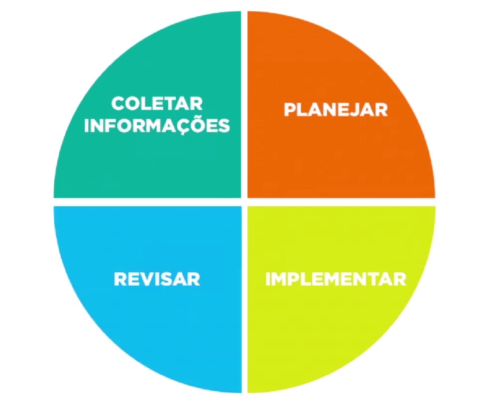

# 202308 Ações para melhorar extração de dados com o cliente

Métodos e ações que funcione e gere resultado, extrair o máximo de informação junto ao solicitante quando o mesmo apresentar duvidas.

**Objetivo**: Melhorar dinâmica para resolução de problemas, com segurança e tomada de decisão inteligente.

## Ciclo do suporte:

### Coleta de informação
- Fazer perguntas adequadas para entender o problema
- Entender qual a expectativa do usuário
- Definir os objetivos
- A comunicação deve ser clara e proativa
- Fornecer canais de comunicação acessíveis para os clientes relatarem os problemas e dúvidas
- Oferecer opções variadas(Email, Chat, Bot, Telefone, HelpDesk)
- Suporte humanizado afim de garantir a satisfação do cliente
- Ter empatia e se colocar no lugar do cliente para entender o grau do problema

### Planejar
- Montar o plano de ação
- Começar de preferência pela tarefa mais fácil que demande menor esforço
- Listar possíveis soluções e complexidade
- Definir os passos a serem seguidos

### Implementar
- Executar o plano de ação
- Se não der certo, voltar a planejar
- Se ainda estiver obscuro, fazer novas perguntas

### Revisar
- Verificar o resultado
- Definir se o mesmo será implantado
- Padronizar ambiente
- Evitar recorrência  
  

## Pontos que agregam valor no suporte:

1. **Central de Autoatendimento:**
   1. Implementar uma base de conhecimento abrangente que inclua tutoriais, perguntas frequentes e soluções para problemas comuns
   2. Permite que os clientes encontrem respostas por conta própria, sem precisar acionar/entrar em contato com o suporte
   3. Precisa implantar a cultura de procurar as respostas
2. **Coleta de Dados(logs, sentry, datadog, Elastic Stack ou ELK(Elasticsearch, Logstash e Kibana), logly):**
   1. Desenvolver mecanismos que capturem informações relevantes sobre(ambiente do cliente, versão do software, sistema operacional etc)
   2. Isso ajuda a equipe de suporte a entender melhor o contexto do problema e a fornecer soluções mais precisas
   3. Analisar previamente a coleta de dados, antes de repassar aos desenvolvedores
      1. Utilizar técnicas de análise de dados para identificar tendências e padrões nos problemas reportados pelos clientes
      2. Isso permite uma abordagem proativa na resolução de problemas recorrentes
3. **Feedback do Cliente**
   1. Coletar feedback dos clientes após a resolução de problemas para avaliar a qualidade do suporte fornecido
   2. Ajuda a identificar áreas de melhoria e ajustar as abordagens de suporte
4. **Treinamento da Equipe de Suporte**
   1. Investir em treinamento contínuo para a equipe de suporte, garantindo que estejam atualizados sobre as últimas versões do software e técnicas de resolução de problemas
5. **Monitoramento em Tempo Real**
   1. Implementar ferramentas que permitam monitorar o desempenho do software em tempo real
   2. Isso ajuda a identificar problemas antes que os clientes os relatem e permite uma resposta mais rápida
6. **Integração com Ferramentas de Gerenciamento de Projetos**
   1. Integrar o sistema de suporte com ferramentas de gerenciamento de projetos para uma abordagem mais estruturada na resolução de problemas complexos

A abordagem ideal pode variar dependendo do tipo de software, do público-alvo e das demandas específicas dos clientes.

É necessário adaptar as ações ao seu contexto, podendo resultar em um suporte de software mais eficaz e orientado por dados.

## SoftSkill

O termo pode ser definido como habilidades emocionais ou comportamentais, ou seja são habilidades que utilizamos no dia a dia para resolver problemas e alcançar resultados com outras pessoas mas que não tem como ser aprendido com um curso, são competências que criamos à partir de experiências, em geral com tudo a nossa volta.

O foco do softskill no suporte/atendimento deve ser utilizado na extração dos dados e entrega de valor ao cliente.

## Maneiras de desenvolver as softskill:

- Aprenda a se autorregular
   - “Se você aprender a administrar suas emoções, vai se recuperar rapidamente do estresse. Isso significa que quando você sentir uma emoção forte surgir, pode se tornar consciente dela, nomeá-la e deixá-la passar sem reagir instantaneamente.”  Isso trará foco e manterá o corpo relaxado – em alerta, porém sem estresse.
- Aprenda a gerenciar seu tempo
   - “Quando for interrompido, pratique se fazer esta pergunta: isso pode esperar? Posso deixar de lado? Você descobrirá que a resposta é quase sempre ‘sim’”, fala.
     Comunique sua decisão com boa vontade e de maneira educada: líderes – e pessoas com boas soft skills – sabem se comunicar gentilmente.
- Crie uma cultura de feedback
   - Crie sua própria cultura de feedback para desenvolver as suas soft skills! Peça para amigos, colegas, professores, gestores e familiares – pessoas que o conhecem profissional e pessoalmente, avaliarem suas habilidades de soft skills e use as respostas para melhorar.

Temos como exemplo alguns softskill abaixo:
- Resiliência
- Colaboração
- Flexibilidade
- Trabalhar sob pressão
- Comunicação eficaz
- Orientação para resultados
- LIderança de equipe

#

## Fontes:
- https://www.youtube.com/watch?v=cTHIdL0tXMA
- https://www.mega.com.br/blog/suporte-de-sistemas-entenda-o-valor-do-suporte-humanizado-7857/
- https://www.zendesk.com.br/blog/atendimento-humanizado-na-educacao/
- https://www.youtube.com/watch?v=Os4u5p1hbaw
- https://www.zendesk.com.br/blog/dica-da-semana-visualizacoes/
- https://www.youtube.com/watch?v=EYOwG0vwFHI
- https://www.youtube.com/watch?v=CNLLSNXZ_uE
- https://www.youtube.com/watch?v=rcWm0xc8AEA
- https://www.youtube.com/watch?v=21qjIOBZA8g
- https://elven.works/conheca-as-12-ferramentas-mais-populares-para-gerenciamento-de-log/
- https://www.napratica.org.br/como-desenvolver-soft-skills/#:~:text=O%20caso%20é%20que%20o,as%20pessoas%20ao%20nosso%20redor